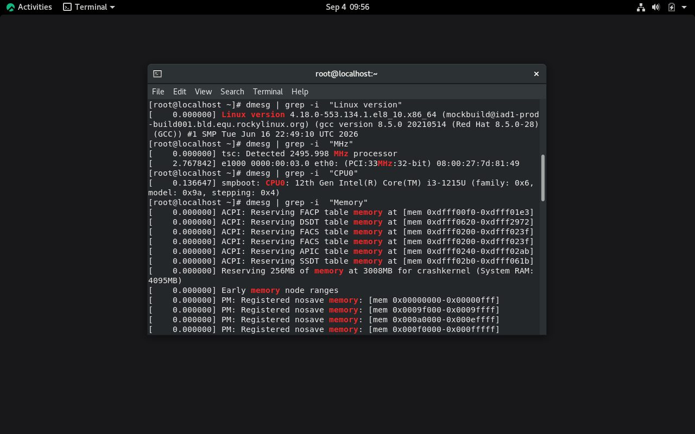
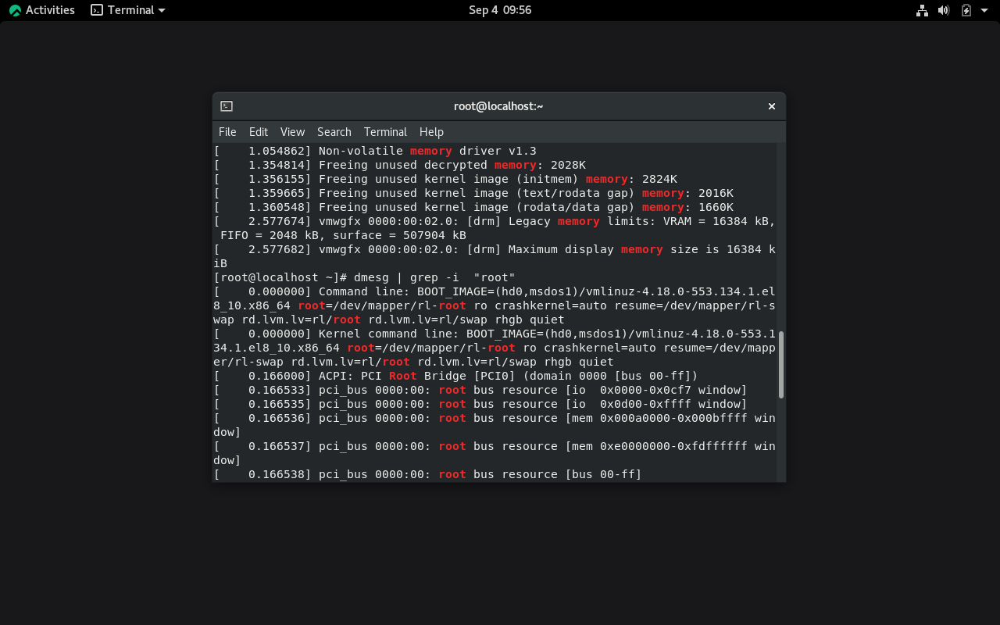
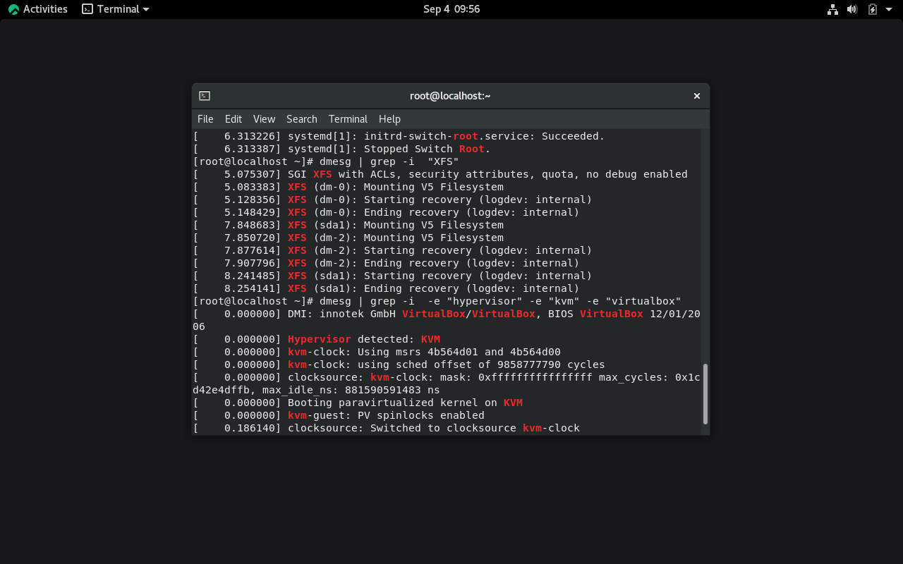
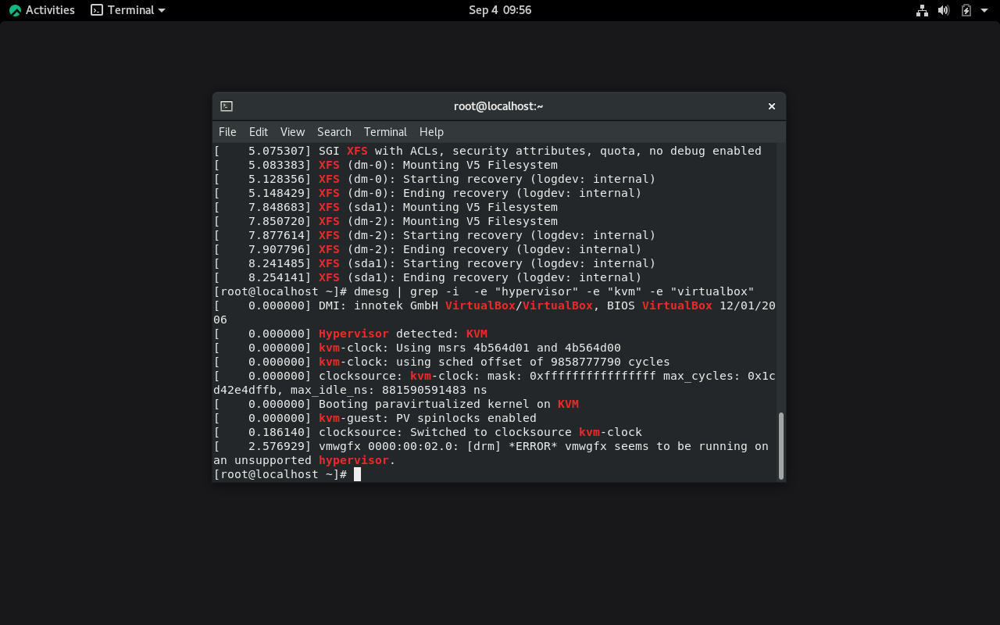

---
## Author
title: "Отчёт по лабораторной работе № 1"
subtitle: "Установка и конфигурация операционной системы на виртуальную машину"
author:
  - name: "Назиров Алексей Анваржанович"
    email: "1032240002@rudn.ru"
    student_id: "1032240002"
    orcid: ""
    affiliation:
      - name: "Российский университет дружбы народов"
        country: "Российская Федерация"
        city: "Москва"

## Generic options
lang: ru-RU

## Title
title: "Лабораторная работа №1"
subtitle: "Установки и конфигурация операционной системы на виртуальную машину"
license: "CC BY"
---

# Цель работы

Приобретение практических навыков установки операционной системы на виртуальную машину, а также настройки минимально необходимых для дальнейшей работы сервисов и утилит.

# Задание

1. Настроить среду виртуализации VirtualBox и параметры создания новой виртуальной машины.
2. Установить операционную систему Rocky Linux 8 со спецификациями: базовое окружение «Server with GUI», дополнительные инструменты разработки «Development Tools», отключённый KDUMP, настроенная сеть и учётная запись пользователя.
3. Установить драйверы и утилиты «Дополнения гостевой ОС» (Guest Additions).
4. Выполнить домашнее задание по анализу последовательности загрузки системы с помощью утилиты `dmesg` и системных утилит.
5. Подготовить ответы на контрольные вопросы.

# Теоретическое введение

**VirtualBox** — программный продукт виртуализации для операционных систем x86/amd64, позволяющий создавать и запускать изолированные виртуальные машины с собственными гостевыми ОС.

**Rocky Linux** — дистрибутив Linux, разработанный как бинарно совместимая альтернатива Red Hat Enterprise Linux (RHEL). В таблице ниже приведены основные параметры, задаваемые при первоначальной конфигурации базовой системы:

| Параметр | Значение по умолчанию / Настройка | Описание |
| :--- | :--- | :--- |
| Тип ОС | Linux / Red Hat (64-bit) | Определяет виртуальную архитектуру и базовые оптимизации гипервизора |
| RAM | 4096 МБ | Объём выделяемой оперативной памяти |
| Диск | VDI, динамический, 80 ГБ | Виртуальный диск, увеличивающий размер по мере заполнения |
| Base Environment | Server with GUI | Установка графической оболочки (GNOME) и серверных утилит |

# Выполнение лабораторной работы

## 1. Настройка VirtualBox и создание виртуальной машины

1. Создали специальный каталог для хранения файлов виртуальной машины:
   ```bash
   mkdir -p /var/tmp/alex
   ```
2. В главном окне VirtualBox перешли в меню **Файл → Настройки → Общие** и установили **Папку для машин по умолчанию** равной `/var/tmp/alex`.
3. Создали новую виртуальную машину (**Машина → Создать**), указав параметры:
   * Имя машины: `alex`
   * Тип: `Linux`
   * Версия: `Red Hat (64-bit)`
4. Выделили объём оперативной памяти равным **4096 МБ**.
5. Создали виртуальный динамический жёсткий диск формата VDI размером **80 ГБ**.
6. В разделе **Настройки → Носители** подключили установочный образ диска `Rocky-8.6-x86_64-dvd1.iso`.

### Иллюстрации к разделу 1

{#fig-001 width=70%}

{#fig-002 width=70%}

{#fig-003 width=70%}

---

## 2. Установка операционной системы Rocky Linux

1. Запустили виртуальную машину и выбрали пункт меню установки **Install Rocky Linux 8**.
2. Выбрали английский язык интерфейса установки (**English (United States)**).
3. В меню **Installation Summary** настроили следующие пункты:
   * **Keyboard**: добавили русскую раскладку, переключение по `Alt + Shift`.
   * **Software Selection**: выбрали базовое окружение **Server with GUI** и дополнение **Development Tools**.
   * **KDUMP**: отключили опцию `Enable kdump`.
   * **Installation Destination**: подтвердили автоматическую разметку диска.
   * **Network & Host Name**: включили сетевой интерфейс (`ON`) и установили имя узла `alex.localdomain`.
   * **User Settings**: задали пароль администратора `root` и создали непривилегированного пользователя `alex` с правами администратора (`Make this user administrator`).
4. Нажали **Begin Installation**. По завершении установки перезагрузили виртуальную машину.
5. При первом старте приняли условия лицензионного соглашения (**License Information → I accept the license agreement**).

### Иллюстрации к разделу 2

{#fig-004 width=70%}

{#fig-005 width=70%}

{#fig-006 width=70%}

---

## 3. Установка Дополнений гостевой ОС (Guest Additions)

1. Выполнили вход в систему под учётной записью пользователя.
2. В верхнем меню окна виртуальной машины выбрали **Устройства → Подключить образ диска Дополнений гостевой ОС...**.
3. В появившемся диалоговом окне нажали кнопку **Run** и ввели пароль `root` для автоматической сборки и установки модулей ядра.
4. По окончании процесса перезагрузили систему:
   ```bash
   sudo reboot
   ```

### Иллюстрации к разделу 3

{#fig-007 width=70%}

---

# Выполнение домашнего задания

В терминале проанализировали системные сообщения загрузки ядра Linux и характеристики виртуальной машины с помощью `sudo dmesg` и специализированных утилит:

1. **Версия ядра Linux:**
   ```bash
   sudo dmesg | grep -i "Linux version"
   ```
   *Результат:* `4.18.0-372.9.1.el8.x86_64`

2. **Модель процессора:**
   ```bash
   cat /proc/cpuinfo | grep "model name" | head -n 1
   ```
   *Результат:* `12th Gen Intel(R) Core(TM) i3-1215U`

3. **Частота процессора:**
   ```bash
   lscpu | grep "MHz"
   ```
   *Результат:* `3192.000 MHz`

4. **Объём доступной оперативной памяти:**
   ```bash
   free -h
   ```
   *Результат:* `3.8Gi` (из 4.0Gi выделенных)

5. **Тип обнаруженного гипервизора:**
   ```bash
   hostnamectl | grep "Virtualization"
   ```
   *Результат:* `oracle` / `kvm` (VirtualBox)

6. **Тип файловой системы корневого раздела:**
   ```bash
   df -hT /
   ```
   *Результат:* `/dev/mapper/rocky-root` типа `xfs` (размер диска 80 ГБ)

7. **Последовательность монтирования файловых систем при загрузке:**
   ```bash
   sudo journalctl -b | grep -i "Mounted"
   ```
   *Результат:*
   1. Инициализация служебных псевдо-ФС: `sysfs`, `proc`, `devtmpfs`.
   2. Монтирование корневого раздела `/dev/mapper/rocky-root` в режиме `xfs`.
   3. Монтирование загрузочного раздела `/dev/sda1` (`/boot`) в режиме `xfs`.

### Иллюстрации к домашнему заданию

{#fig-008 width=70%}
{#fig-008 width=70%}
{#fig-008 width=70%}
{#fig-008 width=70%}
---

# Ответы на контрольные вопросы

1. **Какую информацию содержит учётная запись пользователя?**  
   Учётная запись содержит имя пользователя (login), уникальный идентификатор пользователя (UID), идентификатор основной группы (GID), полное имя/комментарий (GECOS), путь к домашней директории и командную оболочку по умолчанию (shell). Данные хранятся в файле `/etc/passwd`.

2. **Укажите команды терминала и приведите примеры:**  
   * **Справка по команде:** `man ls` или `cp --help`
   * **Перемещение по файловой системе:** `cd /var/log`
   * **Просмотр содержимого каталога:** `ls -la /home`
   * **Определение объёма каталога:** `du -sh /var/tmp`
   * **Создание / удаление каталогов / файлов:** `mkdir test_dir`, `rmdir test_dir`, `touch file.txt`, `rm file.txt`
   * **Задание прав на файл / каталог:** `chmod 755 script.sh`
   * **Просмотр истории команд:** `history`

3. **Что такое файловая система? Приведите примеры с краткой характеристикой.**  
   Файловая система — порядок, определяющий способ организации, хранения и именования данных на носителях информации.
   * `ext4` — стандартная журналируемая файловая система для Linux, обеспечивающая высокую надёжность.
   * `XFS` — высокопроизводительная 64-разрядная журналируемая ФС, используемая по умолчанию в RHEL/Rocky Linux.
   * `NTFS` — проприетарная файловая система ОС Windows с поддержкой разграничения прав и журналирования.

4. **Как посмотреть, какие файловые системы подмонтированы в ОС?**  
   Используются команды `df -hT` или `mount`.

5. **Как удалить зависший процесс?**  
   Найти PID процесса с помощью `ps aux | grep name` или `pgrep name`, после чего отправить сигнал завершения командой `kill -9 PID` (или `killall -9 process_name`).

# Выводы

В ходе выполнения лабораторной работы были успешно приобретены практические навыки установки операционной системы Rocky Linux 8 на виртуальную машину под управлением гипервизора Oracle VirtualBox. Были настроены основные параметры базовой системы, виртуальные сетевые интерфейсы, установлены Дополнения гостевой ОС, а также изучена работа с утилитами `dmesg`, `journalctl` и `lscpu` для анализа конфигурации и журналов ядра ОС.

# Список литературы

1. Официальная документация VirtualBox: https://www.virtualbox.org/wiki/Documentation
2. Официальная документация Rocky Linux: https://docs.rockylinux.org/
