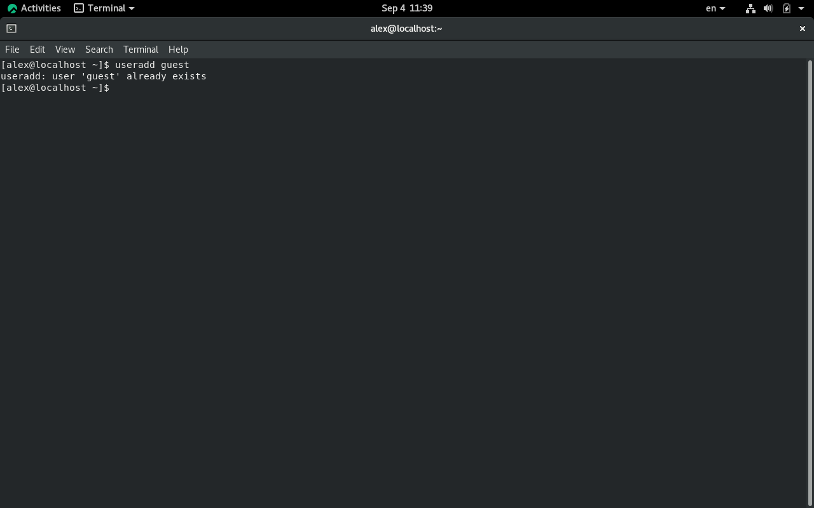
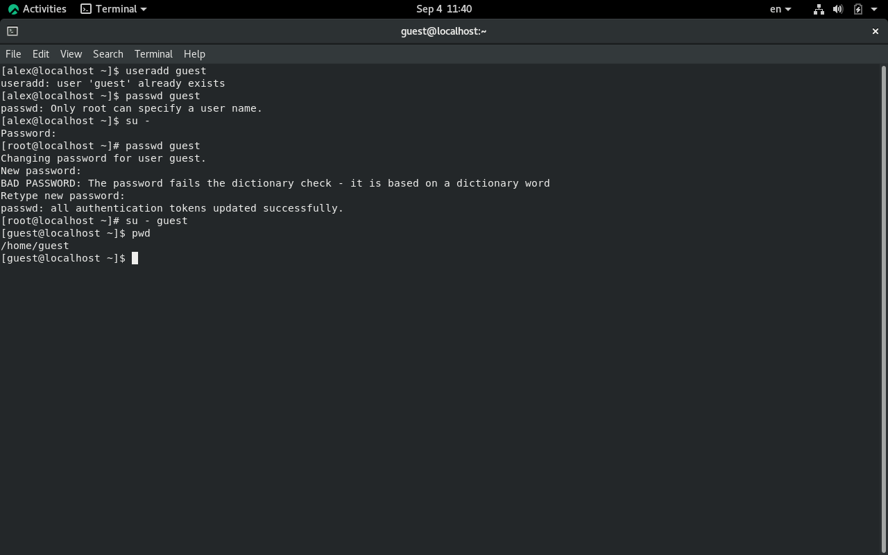
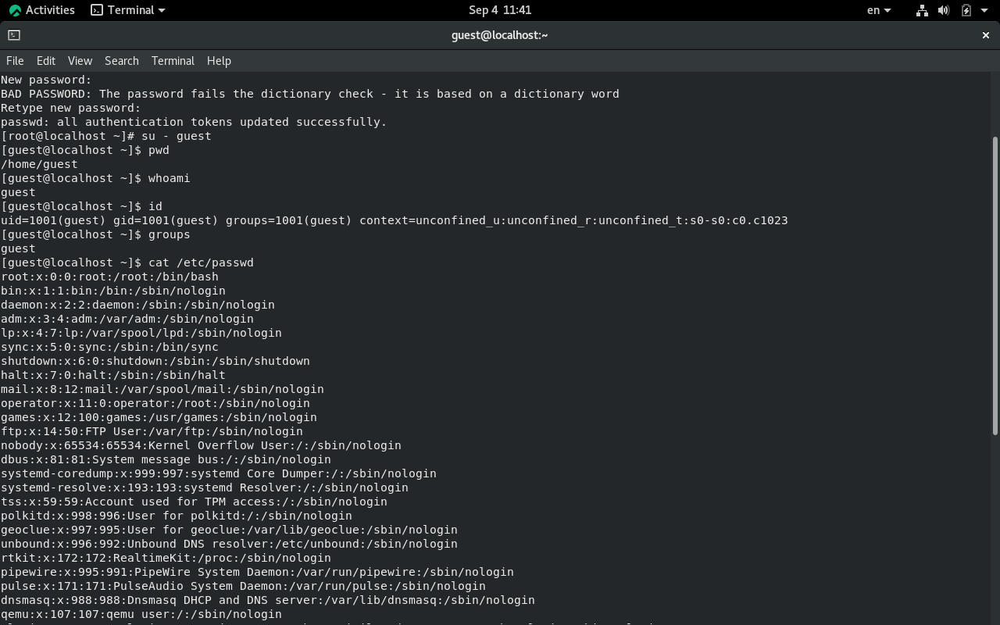
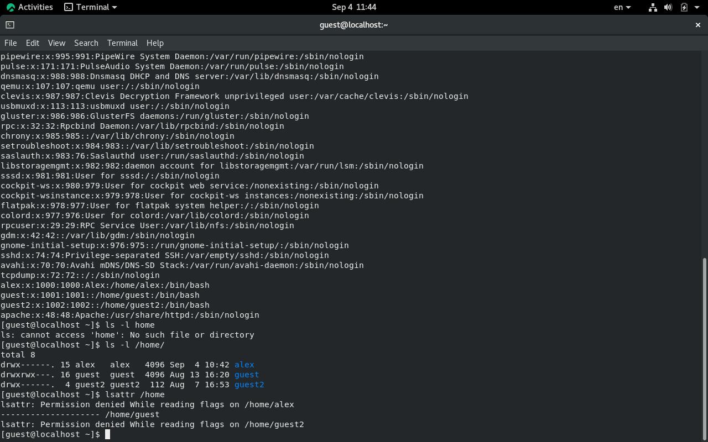
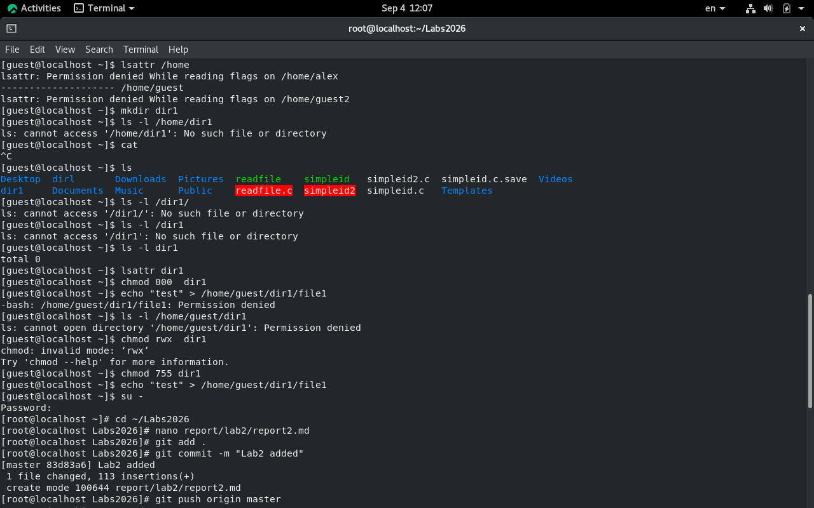

---
## Author
author:
  name: Назиров Алексей Анваржанович
  degrees:
  orcid:
  email: 1032240002@rudn.ru
  affiliation:
    - name: Российский университет дружбы народов
      country: Российская Федерация
      postal-code: 117198
      city: Москва
      address: ул. Миклухо-Маклая, д. 6

## Title
title: "Отчёт по лабораторной работе № 2"
subtitle: "Дискреционное разграничение прав в Linux. Основные атрибуты"
license: "CC BY"
---

# Цель работы

Получение практических навыков работы в консоли с атрибутами файлов, закрепление теоретических основ дискреционного разграничения доступа в современных системах с открытым кодом на базе ОС Linux.

# Задание

1. Создать в системе учётную запись пользователя `guest`.
2. Задать пароль для пользователя `guest`.
3. Войти в систему от имени пользователя `guest`.
4. Определить текущую директорию и проверить домашний каталог.
5. Уточнить имя пользователя, группы и числовые идентификаторы (`uid`, `gid`).
6. Проверить информацию в файле `/etc/passwd`.
7. Проверить права и расширенные атрибуты директорий в `/home/`.
8. Создать поддиректорию `dir1` и исследовать её атрибуты.
9. Снять все права с директории `dir1` и проверить ограничения доступа.
10. Опытным путём заполнить таблицу разрешённых действий и минимальных прав.

# Теоретическое введение

В операционных системах на базе Linux используется дискреционное управление доступом (Discretionary Access Control, DAC). Права доступа определяются для трёх категорий пользователей: владельца файла (user), группы владельца (group) и всех остальных пользователей (others).

Каждому файлу и директории назначаются три основных атрибута:
* Чтение (`r`): позволяет просматривать содержимое файла или список файлов в директории.
* Запись (`w`): позволяет изменять содержимое файла или создавать/удалять файлы в директории.
* Выполнение (`x`): позволяет запускать файл как программу или переходить в директорию.

# Выполнение лабораторной работы

1. Используя учётную запись администратора, мы создали учётную запись пользователя `guest`. Затем задали пароль для пользователя `guest`:
   ```bash
   useradd guest
   passwd guest
   ```



2. Вошли в систему от имени пользователя `guest`. Определили текущую директорию командой `pwd` и убедились, что находимся в домашней директории. Уточнили имя пользователя командой `whoami`. С помощью команды `id` определили `uid`, `gid` и группы пользователя, после чего сравнили вывод с командой `groups`.



3. Просмотрели файл `/etc/passwd` с помощью утилиты `grep`, чтобы вывести только строку с пользователем `guest`:
   ```bash
   cat /etc/passwd | grep guest
   ```
   Убедились, что значения `uid` и `gid` совпадают с полученными ранее.



4. Проверили директории внутри `/home/` и их права доступа командой `ls -l /home/`. Проверили расширенные атрибуты этих директорий командой `lsattr /home`.



5. Создали в домашней директории поддиректорию `dir1` командой `mkdir dir1`. Определили установленные на неё права и расширенные атрибуты командами `ls -l` и `lsattr`.


6. Сняли с директории `dir1` все атрибуты командой `chmod 000 dir1` и проверили результат командой `ls -l`.



7. Попытались создать файл `file1` внутри `dir1` командой `echo "test" > /home/guest/dir1/file1`. Получили отказ в доступе из-за отсутствия необходимых прав на директорию. Проверили, что файл действительно не был создан, командой `ls -l /home/guest/dir1`.


8. Опытным путём проверили доступность операций при различных правах и заполнили таблицу «Установленные права и разрешённые действия».

| Права директории | Права файла | Создание файла | Удаление файла | Запись в файл | Чтение файла | Смена директории | Просмотр файлов в директории | Переименование файла | Смена атрибутов файла |
| :--- | :--- | :--- | :--- | :--- | :--- | :--- | :--- | :--- | :--- |
| `d--------- (000)` | `---------- (000)` | - | - | - | - | - | - | - | - |
| `d--x------ (100)` | `---------- (000)` | - | - | - | - | + | - | - | + |
| `drwx------ (700)` | `-rwx------ (700)` | + | + | + | + | + | + | + | + |

9. На основании полученных в предыдущем пункте данных определили минимально необходимые права для выполнения операций внутри директории `dir1`.

| Операция | Минимальные права на директорию | Минимальные права на файл |
| :--- | :--- | :--- |
| Создание файла | `d-wx------ (300)` | `---------- (000)` |
| Удаление файла | `d-wx------ (300)` | `---------- (000)` |
| Чтение файла | `d--x------ (100)` | `-r-------- (400)` |
| Запись в файл | `d--x------ (100)` | `--w------- (200)` |
| Переименование файла | `d-wx------ (300)` | `---------- (000)` |
| Создание поддиректории | `d-wx------ (300)` | `---------- (000)` |
| Удаление поддиректории | `d-wx------ (300)` | `---------- (000)` |

# Выводы

В ходе выполнения лабораторной работы были получены практические навыки работы в консоли с атрибутами файлов, а также закреплены теоретические основы дискреционного разграничения доступа в современных системах с открытым кодом на базе ОС Linux.

# Список литературы{.unnumbered}

::: {#refs}
:::
