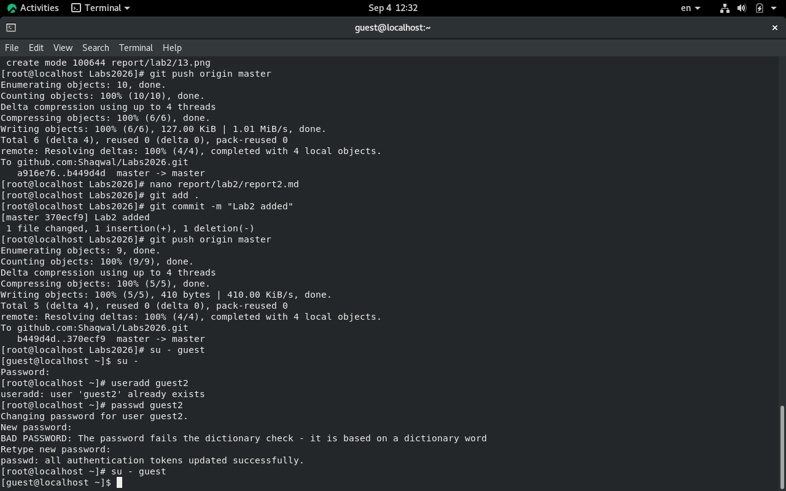
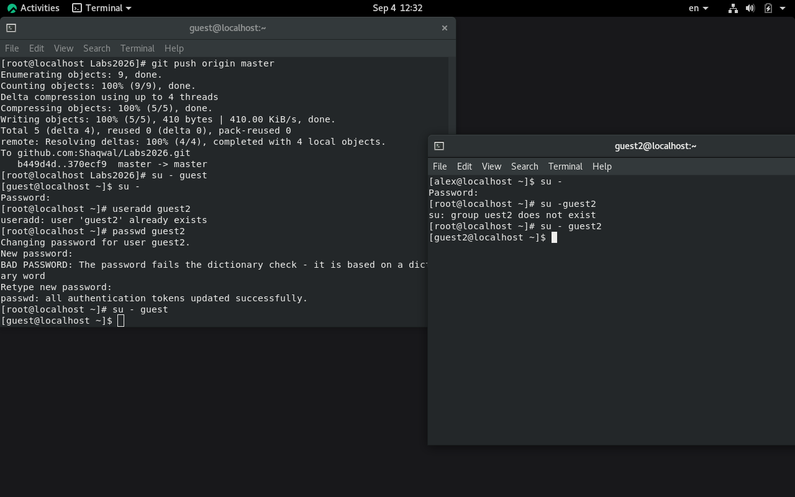
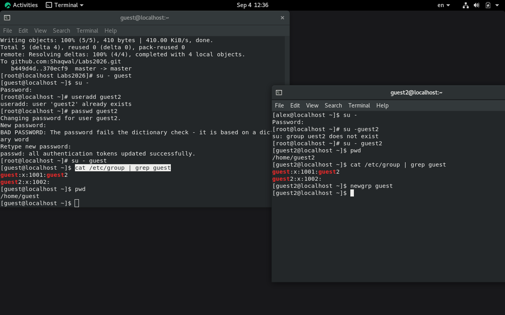
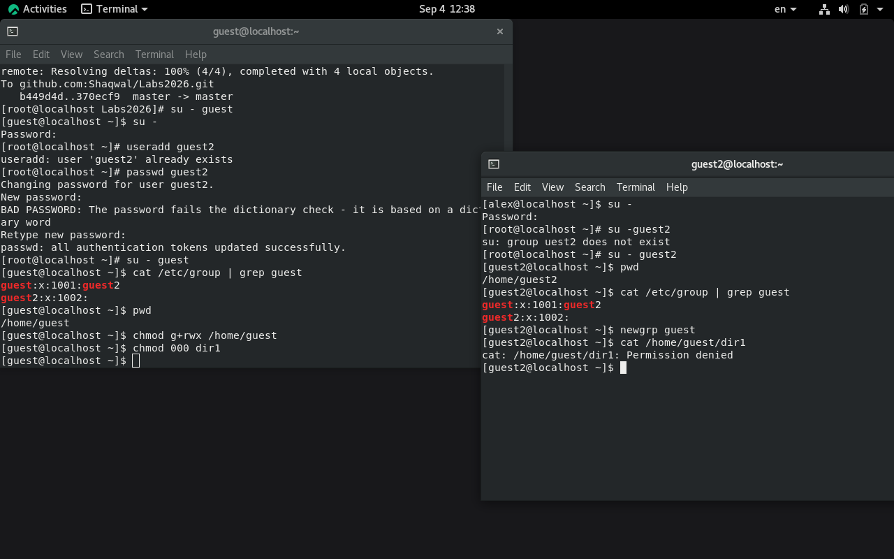

---
## Author
author:
  name: Назиров Алексей Анваржанович
student_id: "1032240002"   
degrees:
  orcid:
  email: 1032240002@rudn.ru  
  affiliation:
    - name: Российский университет дружбы народов
      country: Российская Федерация
      postal-code: 117198
      city: Москва
      address: ул. Миклухо-Маклая, д. 6

## Title
title: "Отчёт по лабораторной работе № 3"
subtitle: "Дискреционное разграничение прав в Linux. Два пользователя"
license: "CC BY"
---

# Цель работы

Получение практических навыков работы в консоли с атрибутами файлов для групп пользователей[cite: 4].

# Задание

1. Создать в системе второго пользователя `guest2` и добавить его в группу `guest`[cite: 4].
2. Выполнить вход в систему от двух пользователей на разных консолях[cite: 4].
3. Изучить информацию о пользователях, их группах и содержимом файла `/etc/group`[cite: 4].
4. Зарегистрировать пользователя `guest2` в группе `guest` с помощью команды `newgrp`[cite: 4].
5. Изменить права доступа к домашней директории и вложенным файлам/директориям[cite: 4].
6. Опытным путём определить разрешённые действия для пользователей, входящих в группу, и заполнить соответствующие таблицы прав[cite: 4].

# Теоретическое введение

В операционных системах семейства Linux помимо прав владельца и остальных пользователей существует уровень разграничения доступа для членов группы файла (group). Это позволяет гибко настраивать совместный доступ к ресурсам для коллективов пользователей.

Для управления членством в группах и проверки принадлежности используются такие утилиты, как `gpasswd`, `groups`, `id` и `newgrp`. Права для группы задаются средней триадой символов в строке атрибутов (например, `rwx` в позициях `---rwx---`).

# Выполнение лабораторной работы

1. Используя учётную запись администратора, мы создали второго пользователя `guest2` и добавили его в группу пользователя `guest`[cite: 4]. Также задали пароли для созданных пользователей:
   ```bash
   useradd guest
   passwd guest
   useradd guest2
   gpasswd -a guest2 guest
   ```



2. Осуществили вход в систему от имени двух пользователей (`guest` и `guest2`) на разных терминалах[cite: 4]. Проверили текущие директории командной `pwd`, а также уточнили параметры пользователей и их групп с помощью команд `groups` и `id`[cite: 4].



3. Просмотрели файл конфигурации групп `/etc/group` с помощью утилиты `grep`, чтобы проверить членство пользователей в группах[cite: 4]:
   ```bash
   cat /etc/group | grep guest
   ```



4. От имени пользователя `guest2` выполнили регистрацию в группе `guest` командой `newgrp guest`[cite: 4].



5. От имени пользователя `guest` изменили права домашней директории `/home/guest`, разрешив все действия для пользователей группы, а также сняли атрибуты с поддиректории `dir1`[cite: 4]:
   ```bash
   chmod g+rwx /home/guest
   chmod 000 dir1
   ```


6. Меняя атрибуты у директории `dir1` и файла `file1` от имени пользователя `guest` и проверяя результат от имени пользователя `guest2`, заполнили таблицу установленных прав и разрешённых действий для групп[cite: 4].

| Права директории | Права файла | Создание файла | Удаление файла | Запись в файл | Чтение файла | Смена директории | Просмотр файлов в директории | Переименование файла | Смена атрибутов файла |
| :--- | :--- | :--- | :--- | :--- | :--- | :--- | :--- | :--- | :--- |
| `d--------- (000)` | `---------- (000)` | - | - | - | - | - | - | - | - |
| `d--x------ (010)` | `---------- (000)` | - | - | - | - | + | - | - | + |
| `d---rwx--- (070)` | `-rwx------ (070)` | + | + | + | + | + | + | + | + |

7. На основании заполненной таблицы определили минимально необходимые права для совершения операций от имени пользователей, входящих в группу[cite: 4].

| Операция | Минимальные права на директорию | Минимальные права на файл |
| :--- | :--- | :--- |
| Создание файла | `d---wx---- (030)` | `---------- (000)` |
| Удаление файла | `d---wx---- (030)` | `---------- (000)` |
| Чтение файла | `d---x----- (010)` | `----r----- (040)` |
| Запись в файл | `d---x----- (010)` | `----w----- (020)` |
| Переименование файла | `d---wx---- (030)` | `---------- (000)` |
| Создание поддиректории | `d---wx---- (030)` | `---------- (000)` |
| Удаление поддиректории | `d---wx---- (030)` | `---------- (000)` |

# Выводы

В ходе выполнения лабораторной работы были получены практические навыки работы в консоли с атрибутами файлов для групп пользователей в операционных системах на базе ОС Linux[cite: 4].

# Список литературы{.unnumbered}

::: {#refs}
:::
