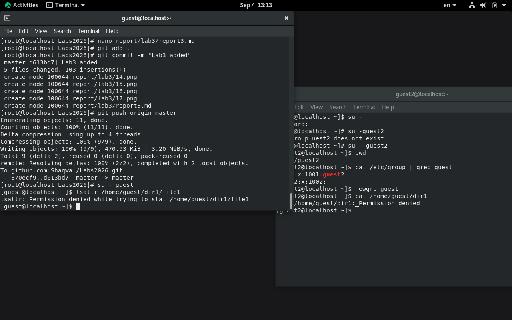
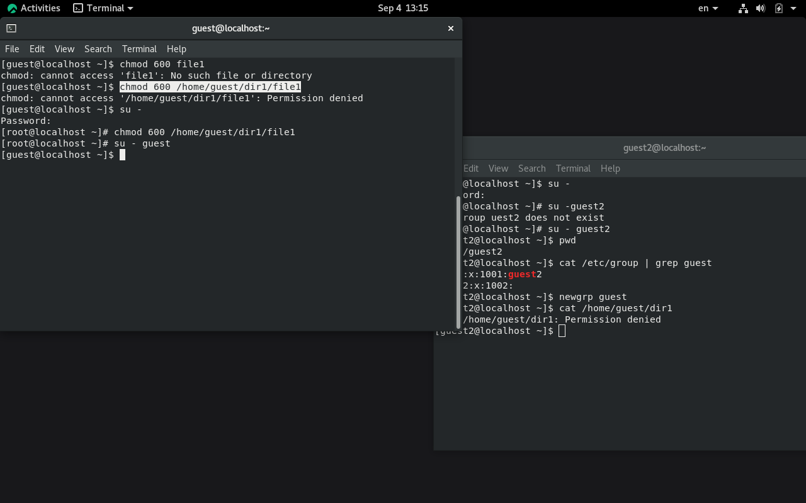
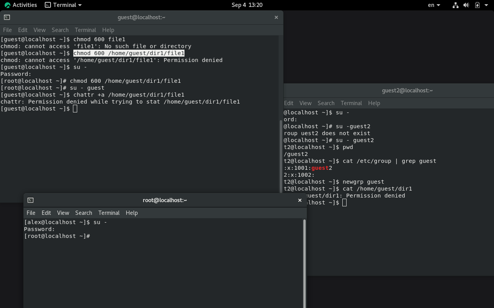
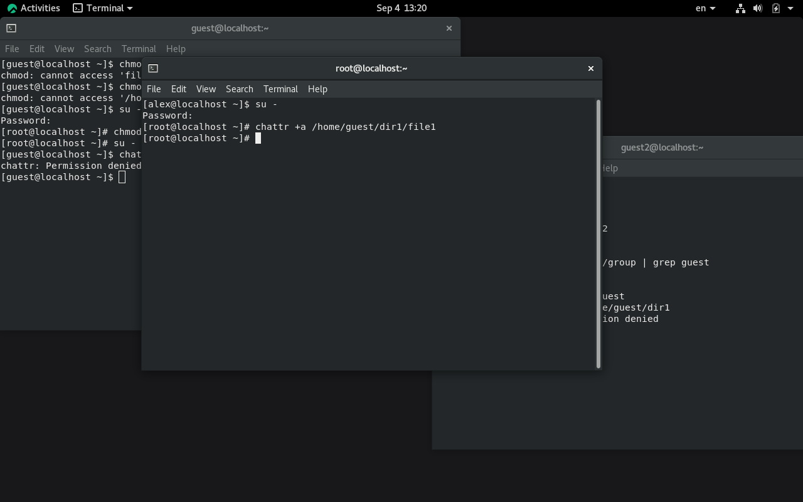
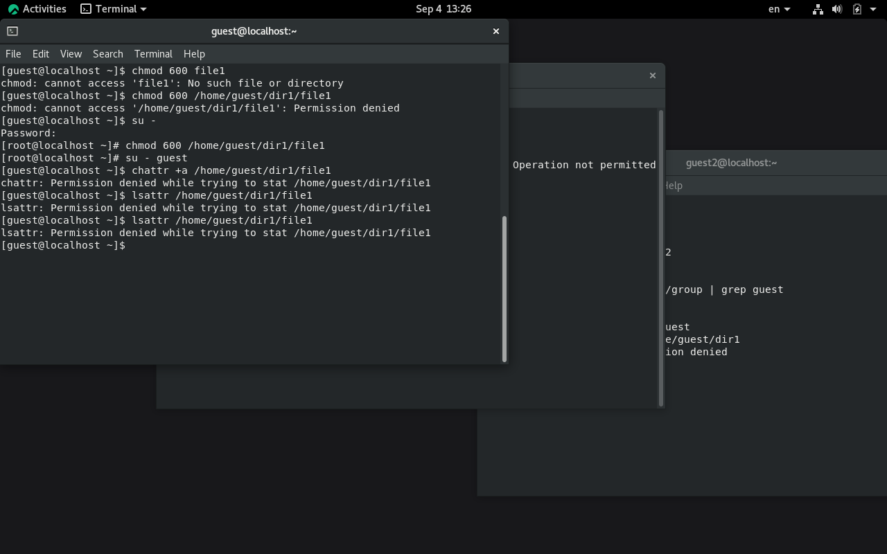
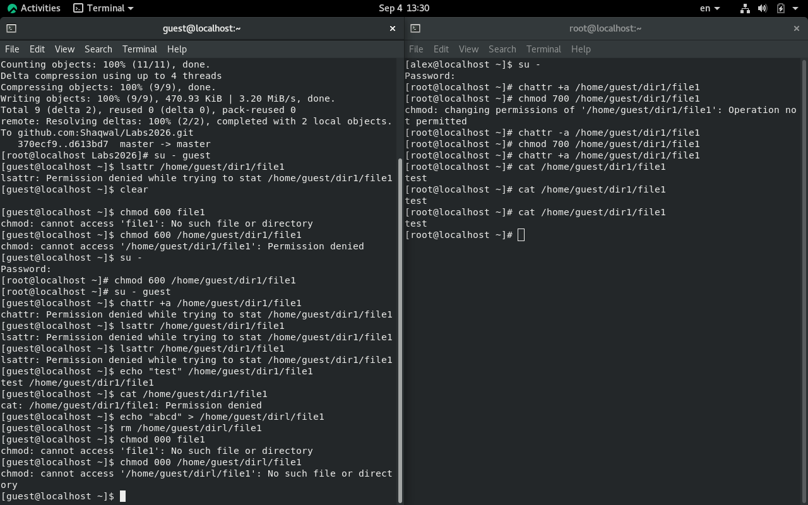
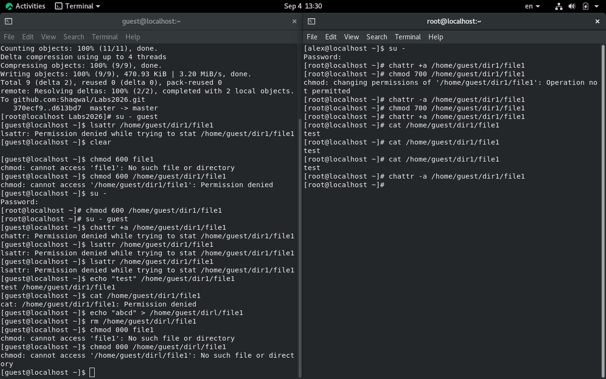
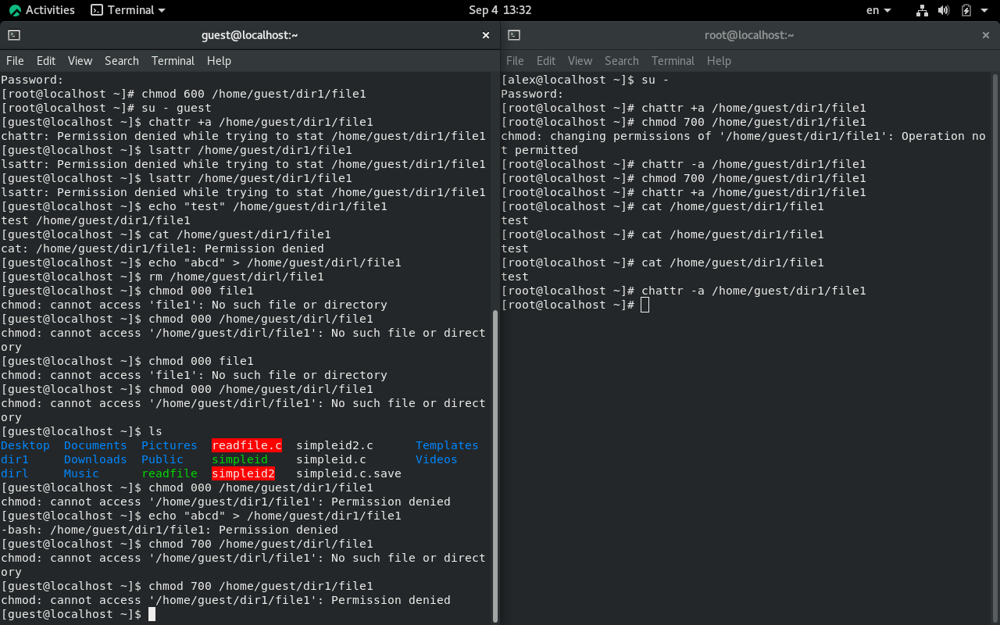
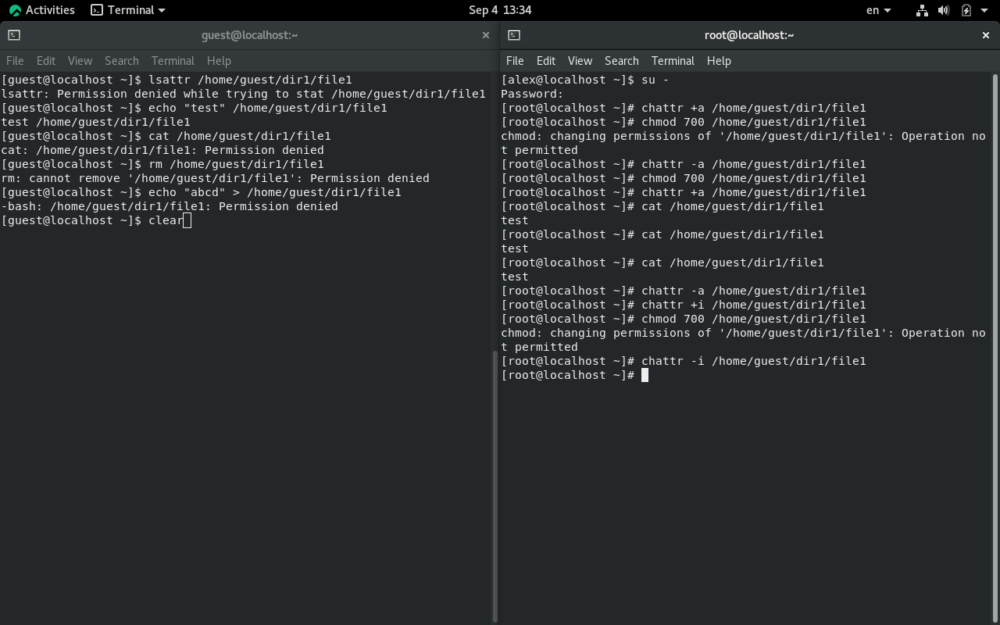

---
## Author
author:
  name: Назиров Алексей Анваржанович
  student_id: "1032240002"
  degrees:
  orcid:
  email: 1032240002@rudn.ru
  affiliation:
    - name: Российский университет дружбы народов
      country: Российская Федерация
      postal-code: 117198
      city: Москва
      address: ул. Миклухо-Маклая, д. 6

## Title
title: "Отчёт по лабораторной работе № 4"
subtitle: "Дискреционное разграничение прав в Linux. Расширенные атрибуты"
license: "CC BY"
---

# Цель работы

Получение практических навыков работы в консоли с расширенными атрибутами файлов[cite: 5].

# Задание

1. Определить расширенные атрибуты тестового файла от имени обычного пользователя[cite: 5].
2. Установить на файл права чтения и записи для владельца[cite: 5].
3. Опытным путём попытаться установить расширенный атрибут `a` (append-only) от имени обычного пользователя и администратора[cite: 5].
4. Проверить влияние атрибута `a` на операции дозаписи, перезаписи, чтения, удаления, переименования и изменения базовых прав файла[cite: 5].
5. Снять расширенный атрибут `a` и повторить заблокированные ранее операции[cite: 5].
6. Повторить цикл исследования для расширенного атрибута `i` (immutable)[cite: 5].

# Теоретическое введение

В дополнение к стандартным правам доступа (чтение, запись, выполнение), в файловых системах ОС Linux (например, ext4) поддерживаются расширенные атрибуты, которые позволяют накладывать дополнительные ограничения на работу с файлами. Управление ими осуществляется с помощью утилит `lsattr` (просмотр атрибутов) и `chattr` (изменение атрибутов).
* Атрибут `a` (append-only) разрешает открывать файл только для добавления данных в конец, запрещая удаление, переименование и перезапись[cite: 5].
* Атрибут `i` (immutable) делает файл полностью неизменяемым: его нельзя модифицировать, удалить, переименовать или создать жесткую ссылку[cite: 5].
Изменять расширенные атрибуты может только суперпользователь (root)[cite: 5].

# Выполнение лабораторной работы

1. От имени пользователя `guest` мы определили расширенные атрибуты файла `/home/guest/dir1/file1` командой `lsattr /home/guest/dir1/file1`[cite: 5].

2. Установили на файл `file1` права `600`, разрешающие чтение и запись только для владельца файла[cite: 5].

3. Попробовали установить на файл `/home/guest/dir1/file1` расширенный атрибут `a` от имени пользователя `guest` командой `chattr +a`[cite: 5]. В ответ мы закономерно получили отказ от выполнения операции, так как для этого требуются права администратора[cite: 5].

4. Зашли в консоль с правами суперпользователя (администратора) и успешно установили расширенный атрибут `a` на файл `/home/guest/dir1/file1`[cite: 5].

5. Вернувшись к пользователю `guest`, проверили правильность установления атрибута с помощью команды `lsattr`[cite: 5].

6. Выполнили дозапись в файл `file1` слова «test» с помощью оператора перенаправления `>>`[cite: 5]. Затем прочитали файл командой `cat` и убедились, что слово "test" было успешно записано[cite: 5].

7. Попробовали стереть имеющуюся в нём информацию путем перезаписи файла командой `echo "abcd" > /home/guest/dir1/file1`, а также попытались удалить и переименовать файл[cite: 5]. Все эти операции завершились ошибкой, так как атрибут `a` защищает файл от любого изменения, кроме добавления в конец[cite: 5].

8. Попробовали с помощью команды `chmod 000 file1` снять все базовые права на файл[cite: 5]. Выполнить данную команду не удалось из-за действия расширенного атрибута `a`[cite: 5].

9. Переключившись на суперпользователя, сняли расширенный атрибут `a` с файла командой `chattr -a /home/guest/dir1/file1`[cite: 5]. После этого операции перезаписи, переименования, удаления и изменения прав (`chmod 000`) завершились успешно[cite: 5].

10. Повторили аналогичные действия, заменив атрибут `a` на атрибут `i` (immutable) командой `chattr +i`[cite: 5]. Наши наблюдения показали, что при установленном атрибуте `i` блокируются абсолютно все попытки изменения файла, включая дозапись информации, которая была разрешена при атрибуте `a`[cite: 5].

# Выводы

В результате выполнения работы мы повысили свои навыки использования интерфейса командной строки, познакомились на примерах с тем, как используются основные и расширенные атрибуты при разграничении доступа в ОС Linux[cite: 5]. Мы на практике опробовали действие расширенных атрибутов `a` и `i`, подтвердив теорию дискреционного разделения доступа[cite: 5].

# Список литературы{.unnumbered}

::: {#refs}
:::
