---
## Author
author:
  name: Назиров Алексей Анваржанович
  student_id: "1032240002"
  degrees:
  orcid:
  email: 1032240002@rudn.ru
  affiliation:
    - name: Российский университет дружбы народов
      country: Российская Федерация
      postal-code: 117198
      city: Москва
      address: ул. Миклухо-Маклая, д. 6

## Title
title: "Отчёт по лабораторной работе № 5"
subtitle: "Дискреционное разграничение прав в Linux. Исследование влияния дополнительных атрибутов"
license: "CC BY"
---

# Цель работы

Изучение механизмов изменения идентификаторов, применения SetUID- и Sticky-битов[cite: 6]. Получение практических навыков работы в консоли с дополнительными атрибутами[cite: 6]. Рассмотрение работы механизма смены идентификатора процессов пользователей, а также влияние бита Sticky на запись и удаление файлов[cite: 6].

# Задание

1. Подготовить лабораторный стенд и убедиться в наличии компилятора `gcc`[cite: 6].
2. Создать, скомпилировать и выполнить программы на языке С (`simpleid.c`, `simpleid2.c`, `readfile.c`)[cite: 6].
3. Изучить влияние битов SetUID и SetGID на выполнение программ и права доступа к файлам[cite: 6].
4. Исследовать влияние атрибута Sticky, установленного на директорию `/tmp`, на операции с файлами от имени стороннего пользователя[cite: 6].

# Теоретическое введение

Дополнительные атрибуты (SetUID, SetGID, Sticky-бит) используются для расширения стандартной модели дискреционного доступа. Компиляторы, доступные в Linux-системах, являются частью коллекции GNU-компиляторов, где компилятор языка С называется `gcc`[cite: 6]. Процесс создания программы включает превращение исходных файлов в объектный код и их последующую компоновку[cite: 6]. Механизм компилирования рассматривается в данной работе, поскольку использование bash-скриптов для изучения битов смены идентификатора невозможно из-за того, что интерпретатор выполняется с правами запустившего его пользователя, игнорируя атрибуты самого скрипта[cite: 6].

# Выполнение лабораторной работы

## 1. Создание программы и изучение SetUID/SetGID

1. От имени пользователя `guest` мы создали программу `simpleid.c` с использованием системных вызовов `getuid()` и `getgid()`, скомпилировали её командой `gcc simpleid.c -o simpleid` и выполнили[cite: 6]. Сравнили её вывод с системной программой `id` и убедились в идентичности результатов[cite: 6].

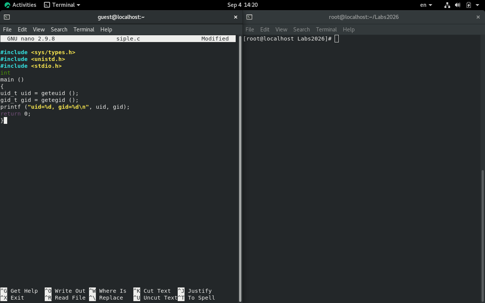

2. Усложнили исходный код программы, добавив вывод действительных (real) и эффективных (effective) идентификаторов, сохранив её как `simpleid2.c`[cite: 6]. Скомпилировали и запустили полученный файл[cite: 6].

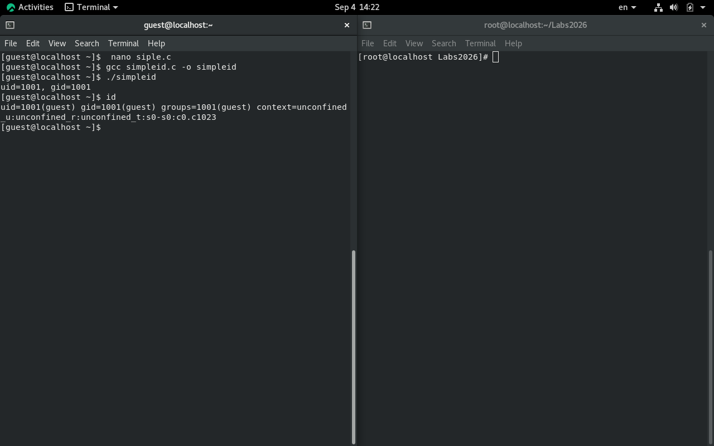

3. Повысив права до суперпользователя (root), сменили владельца файла `simpleid2` и установили на него SetUID-бит с помощью команд[cite: 6]:
   ```bash
   chown root:guest /home/guest/simpleid2
   chmod u+s /home/guest/simpleid2
   ```
   Команда `chown` изменяет владельца файла, а `chmod u+s` устанавливает бит, позволяющий программе выполняться с правами её владельца (в данном случае — root)[cite: 6].

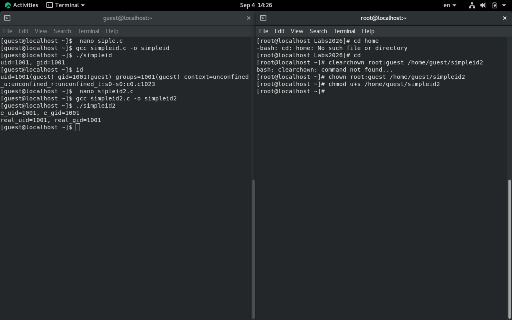

4. Вернувшись к пользователю `guest`, проверили правильность установки новых атрибутов командой `ls -l` и снова запустили программу[cite: 6]. Результат `e_uid=0` показал, что программа выполнилась с правами суперпользователя. Аналогичные действия были проделаны для SetGID-бита (атрибут `s` для группы), что позволило сменить эффективную группу при выполнении[cite: 6].

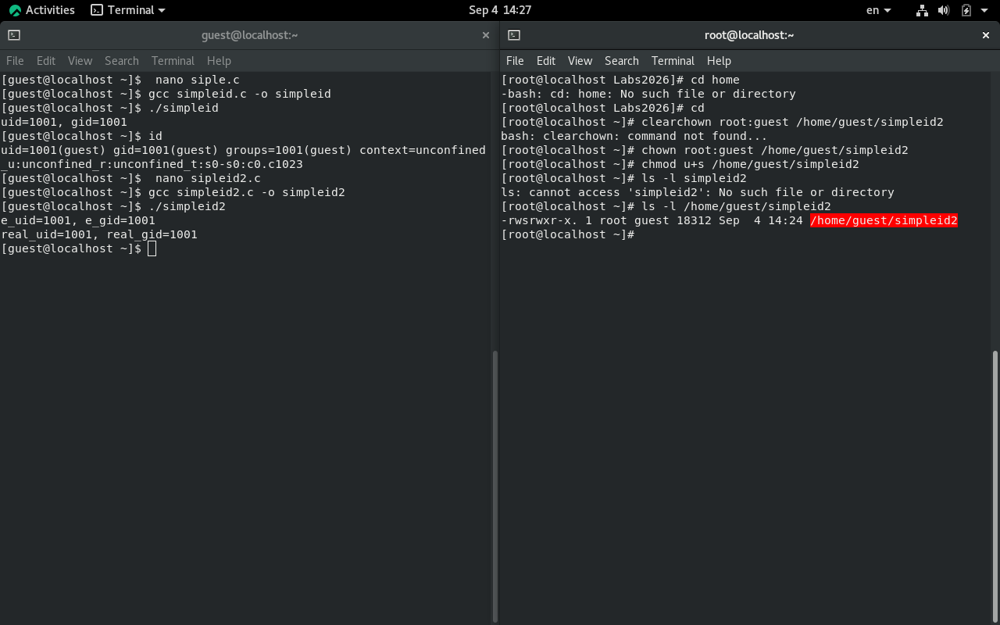

5. Создали программу `readfile.c`, предназначенную для посимвольного чтения файла, и откомпилировали её[cite: 6].

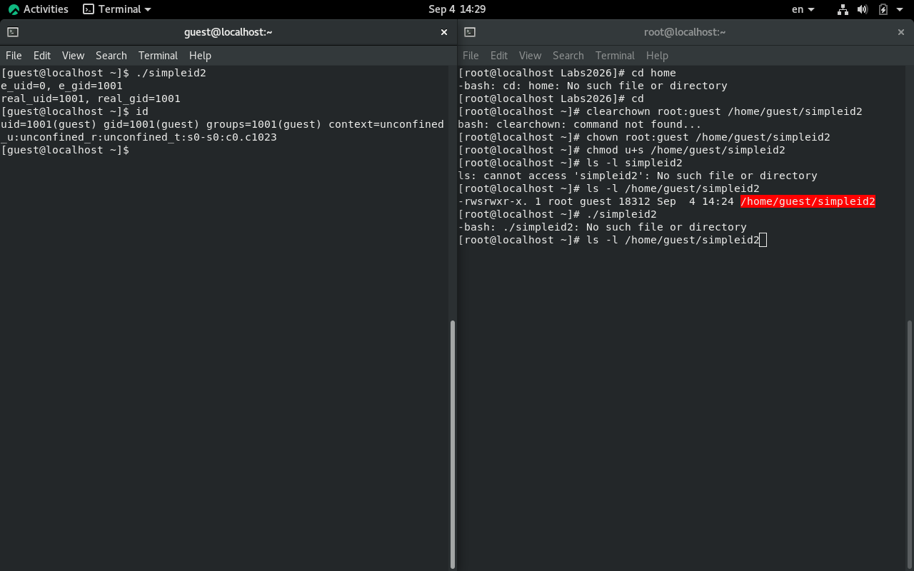

6. Изменили владельца файла `readfile.c` на root и сняли права на чтение для всех остальных, убедившись, что обычный пользователь не может его прочитать[cite: 6].

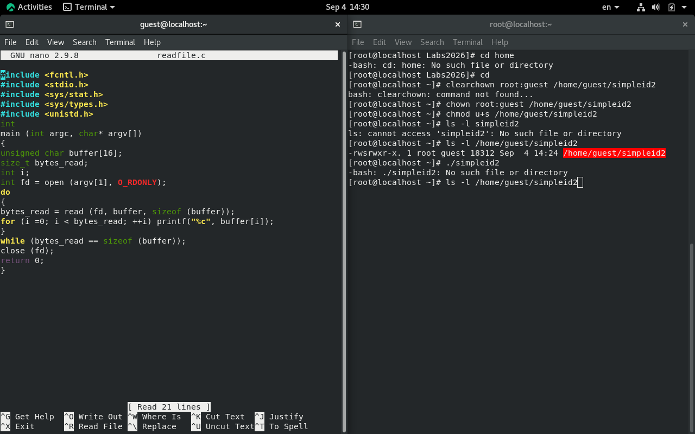

7. Изменили владельца исполняемого файла `readfile` на root и установили SetUID-бит[cite: 6]. Проверили, что теперь программа может прочитать как защищенный файл `readfile.c`, так и критически важный системный файл `/etc/shadow`[cite: 6].

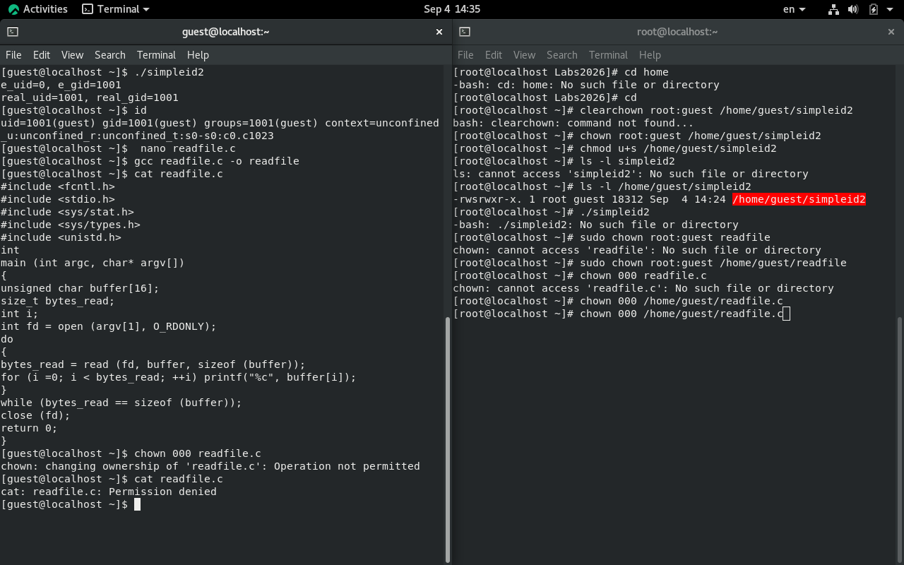

## 2. Исследование Sticky-бита

8. Выяснили, что атрибут Sticky установлен на директории `/tmp`, выполнив команду `ls -l / | grep tmp` (атрибут обозначается буквой `t` в конце списка прав)[cite: 6]. От имени пользователя `guest` создали там файл `file01.txt` со словом "test" и разрешили чтение и запись для всех остальных пользователей (`chmod o+rw`)[cite: 6].

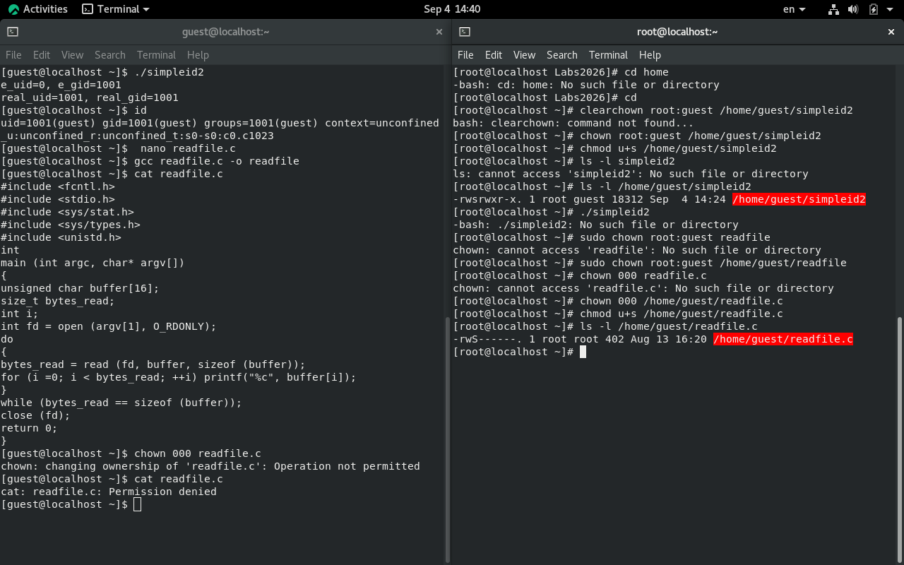

9. Переключившись на пользователя `guest2` (не являющегося владельцем файла), успешно прочитали файл, дописали в него информацию оператором `>>` и полностью перезаписали содержимое оператором `>`[cite: 6]. Однако попытка удалить файл командой `rm /tmp/file01.txt` завершилась отказом из-за действия Sticky-бита на родительской директории[cite: 6].

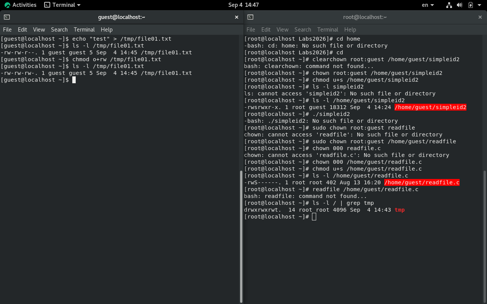

10. От имени администратора сняли Sticky-бит с директории `/tmp` командой `chmod -t /tmp`[cite: 6]. Повторив действия от пользователя `guest2`, мы выяснили, что теперь файл `file01.txt` удалось беспрепятственно удалить, несмотря на то, что `guest2` не являлся его владельцем[cite: 6]. В конце работы суперпользователь вернул защитный атрибут на директорию[cite: 6].

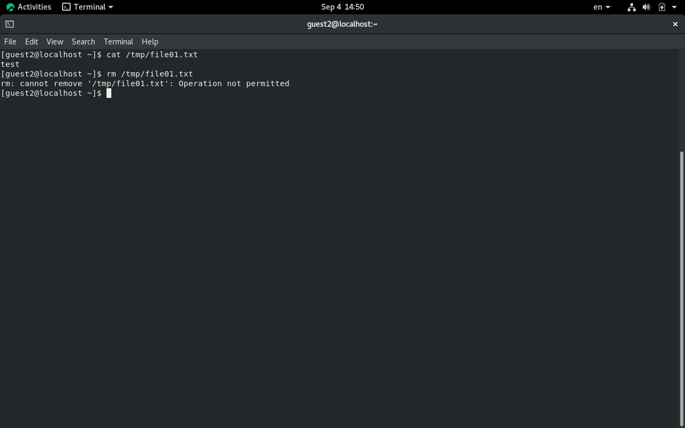
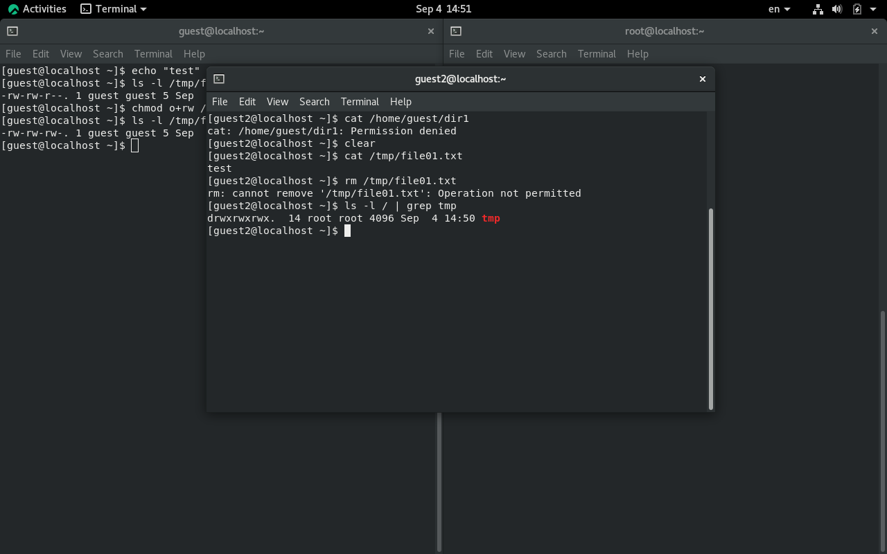
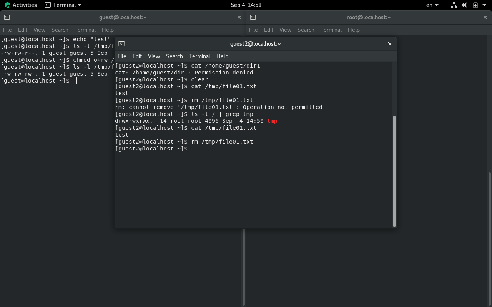
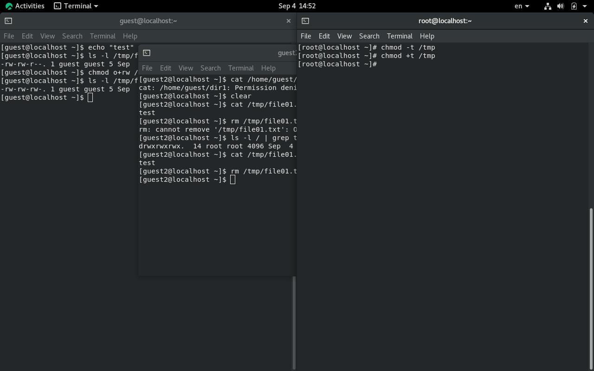

# Выводы

В ходе выполнения лабораторной работы были изучены механизмы изменения идентификаторов, применения SetUID- и Sticky-битов[cite: 6]. Получены практические навыки работы в консоли с дополнительными атрибутами ОС Linux, а также наглядно рассмотрено влияние бита Sticky на операции записи и удаления файлов сторонними пользователями[cite: 6].

# Список литературы{.unnumbered}

::: {#refs}
:::
