---
## Author
author:
  name: Назиров Алексей Анваржанович
  student_id: "1032240002"
  degrees:
  orcid:
  email: 1032240002@rudn.ru
  affiliation:
    - name: Российский университет дружбы народов
      country: Российская Федерация
      postal-code: 117198
      city: Москва
      address: ул. Миклухо-Маклая, д. 6

## Title
title: "Отчёт по лабораторной работе № 6"
subtitle: "Мандатное разграничение прав в Linux"
license: "CC BY"
---

# Цель работы

Развить навыки администрирования ОС Linux[cite: 7]. Получить первое практическое знакомство с технологией SELinux[cite: 7]. Проверить работу SELinux на практике совместно с веб-сервером Apache[cite: 7].

# Задание

1. Убедиться, что SELinux работает в режиме enforcing политики targeted[cite: 7].
2. Обратиться к веб-серверу Apache и убедиться, что он работает[cite: 7].
3. Найти веб-сервер в списке процессов и определить его контекст безопасности[cite: 7].
4. Посмотреть текущее состояние переключателей SELinux для Apache и статистику по политике[cite: 7].
5. Определить тип файлов в директориях `/var/www` и `/var/www/html`[cite: 7].
6. Создать тестовый html-файл и проверить его контекст по умолчанию[cite: 7].
7. Изменить контекст файла, чтобы запретить доступ процессу httpd, и проанализировать логи[cite: 7].
8. Попробовать запустить Apache на порту 81, проанализировать сбой и разрешить работу на этом порту средствами SELinux[cite: 7].
9. Вернуть исходные настройки веб-сервера и удалить тестовый файл[cite: 7].

# Теоретическое введение

SELinux использует контексты безопасности для мандатного разграничения прав доступа.
* Контекст состоит из пользователя, роли и типа (например, пользователю `unconfined_u` сопоставляется роль `object_r` и определенный тип)[cite: 7].
* Политика ролевого разделения доступа (RBAC) используется процессами, поэтому для файлов на постоянных носителях роли (например, `object_r`) применяются по умолчанию и не имеют большого значения[cite: 7].
* Основную роль при доступе играет тип[cite: 7]. Например, тип `httpd_sys_content_t` позволяет процессу httpd (веб-серверу) получить доступ к файлу при обращении через браузер[cite: 7].

# Выполнение лабораторной работы

1. С помощью команд `getenforce` и `sestatus` мы убедились, что SELinux работает в режиме `enforcing` с политикой `targeted`[cite: 7].

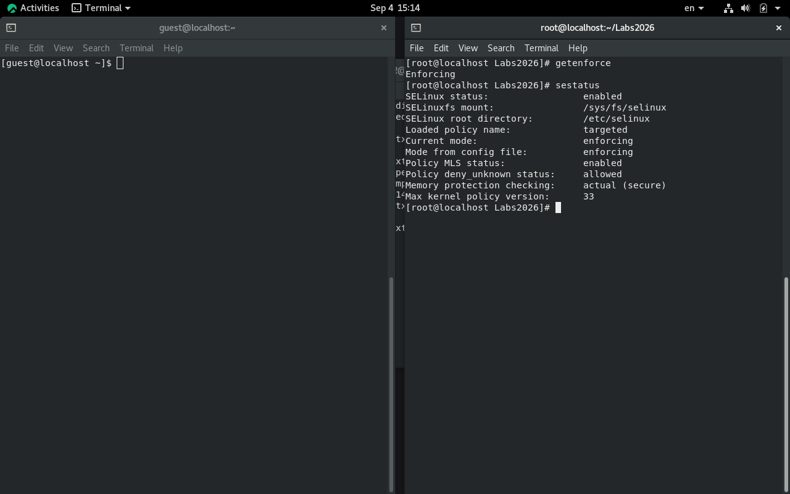

2. Обратились к веб-серверу с помощью команды `service httpd status` (или `/etc/rc.d/init.d/httpd status`) и убедились в его работоспособности[cite: 7].

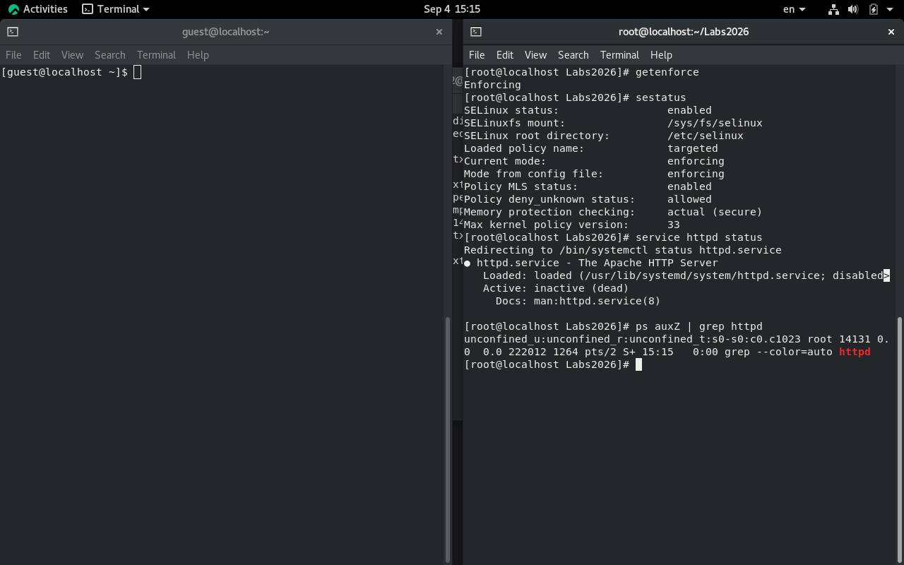

3. Нашли процесс веб-сервера Apache командой `ps auxZ | grep httpd` и определили его контекст безопасности[cite: 7].

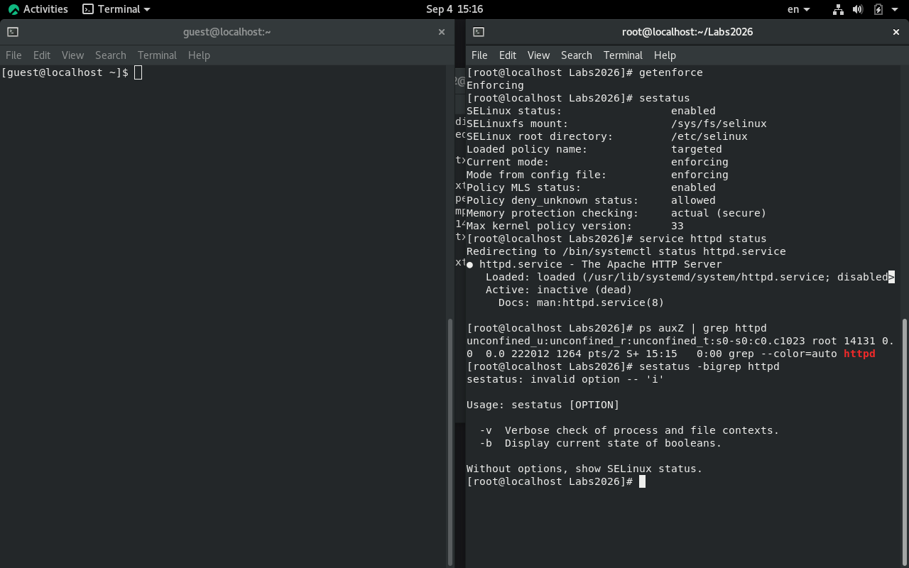

4. Посмотрели состояние переключателей SELinux для Apache командой `sestatus -b | grep httpd` (многие из них находились в положении "off"), а также изучили статистику политик с помощью команды `seinfo`[cite: 7].

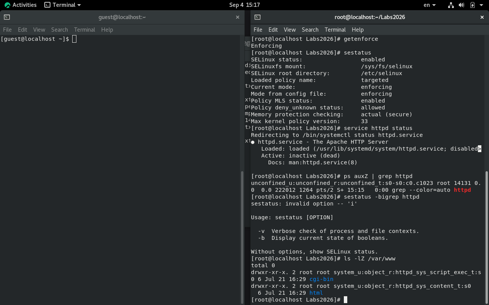

5. Проверили типы файлов и директорий в `/var/www` и `/var/www/html` с помощью команды `ls -lZ`[cite: 7]. Выяснили, что по умолчанию создавать файлы в директории `/var/www/html` разрешено только суперпользователю[cite: 7].

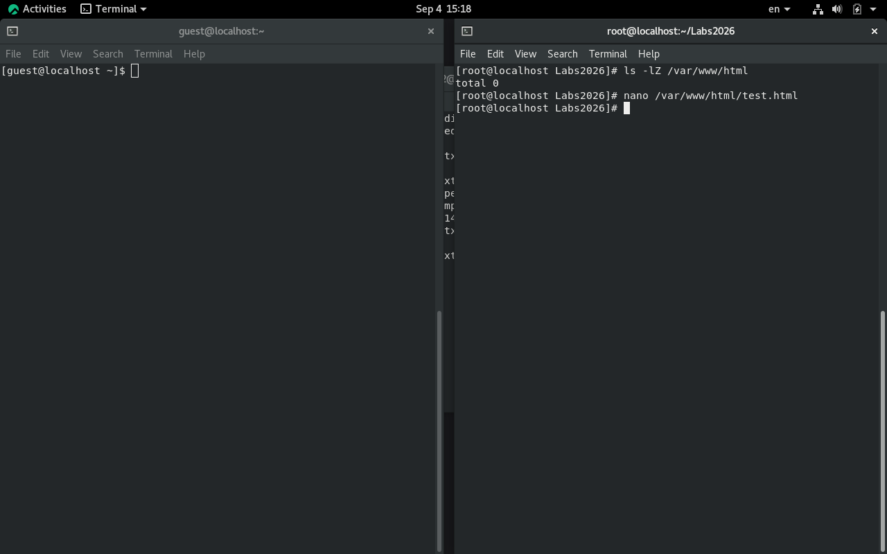

6. От имени суперпользователя создали файл `/var/www/html/test.html` и проверили его контекст командой `ls -Z`[cite: 7]. Ему был автоматически присвоен тип `httpd_sys_content_t`, благодаря чему мы успешно обратились к файлу через браузер по адресу `http://127.0.0.1/test.html`[cite: 7].

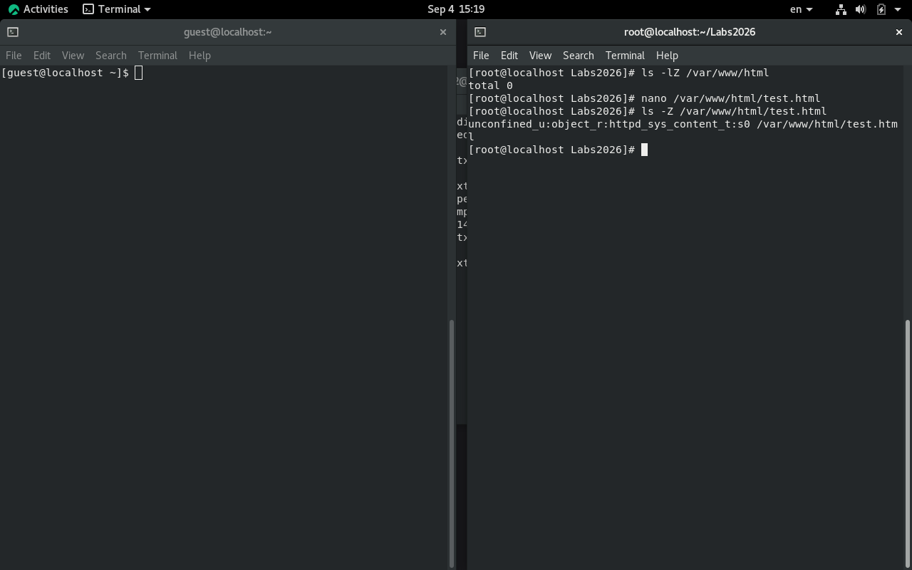

7. Изменили контекст файла на `samba_share_t` с помощью команды `chcon -t samba_share_t /var/www/html/test.html`[cite: 7]. После этого попытка получить доступ к файлу через веб-сервер завершилась ошибкой "Forbidden" (You don't have permission to access /test.html on this server), хотя базовые права на чтение у файла оставались[cite: 7].

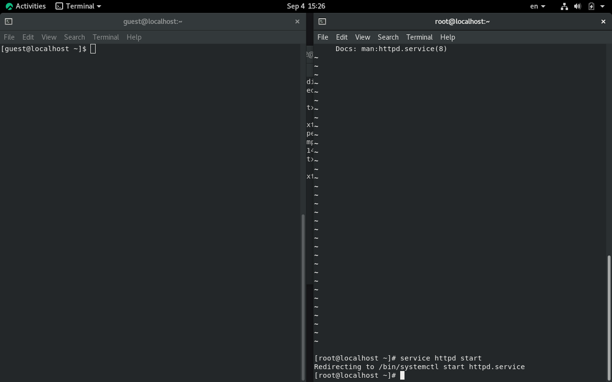

8. Мы проанализировали системные логи в `/var/log/messages` и `/var/log/audit/audit.log`, обнаружив там записи о блокировке доступа со стороны SELinux из-за несоответствия типа[cite: 7].

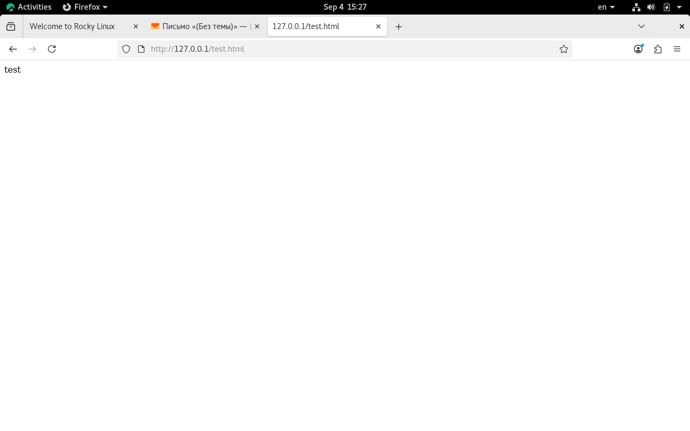

9. Изменили конфигурационный файл `/etc/httpd/httpd.conf`, заменив прослушиваемый порт с 80 на 81 (`Listen 81`)[cite: 7]. Перезапуск веб-сервера завершился сбоем, так как SELinux по умолчанию запрещает процессу httpd использовать этот порт, что подтвердилось записями в логах[cite: 7].

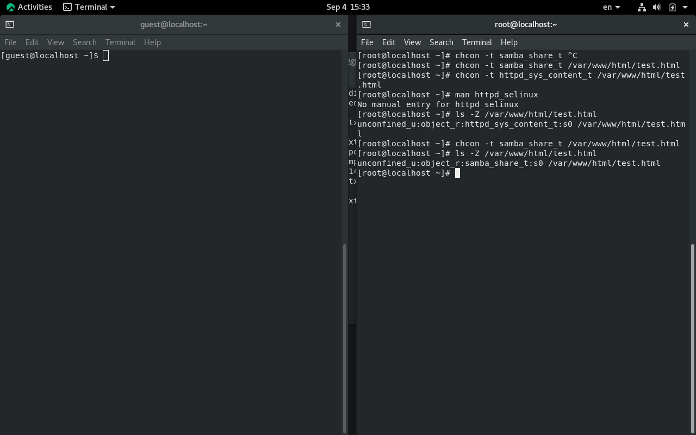

10. Разрешили привязку типа `http_port_t` к 81 порту командой `semanage port -a -t http_port_t -p tcp 81`[cite: 7]. Проверили результат командой `semanage port -l | grep http_port_t` и убедились, что порт 81 появился в списке, после чего веб-сервер успешно запустился[cite: 7].

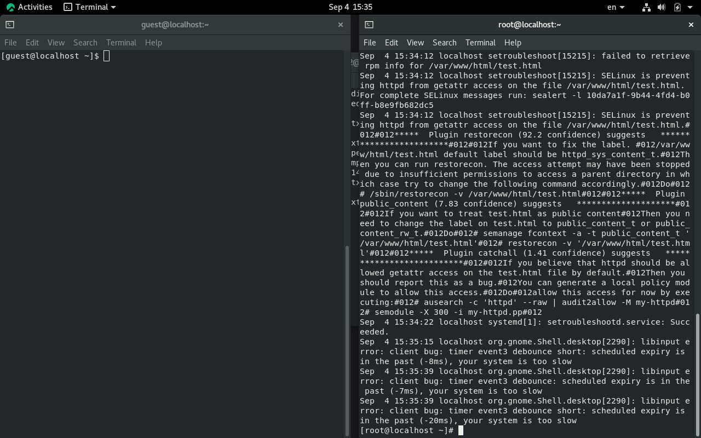

11. Вернули файлу контекст `httpd_sys_content_t` командой `chcon` и успешно открыли его через порт 81[cite: 7]. Затем исправили обратно конфигурационный файл Apache на порт 80, удалили привязку порта 81 командой `semanage port -d -t http_port_t -p tcp 81` и удалили сам тестовый файл[cite: 7].

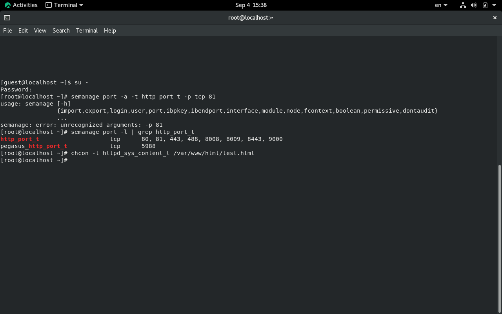
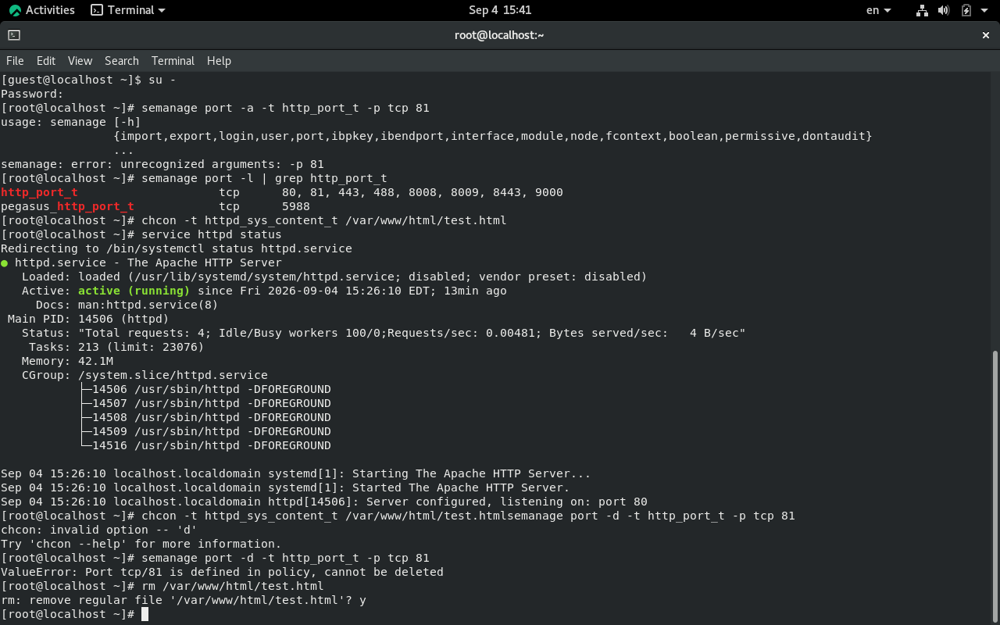

# Выводы

В ходе выполнения работы мы развили навыки администрирования ОС Linux и получили первое практическое знакомство с технологией SELinux[cite: 7]. Мы успешно проверили работу мандатного разграничения доступа на практике совместно с веб-сервером Apache, изучив влияние контекстов файлов и политик портов на работоспособность системных служб[cite: 7].

# Список литературы{.unnumbered}

::: {#refs}
:::
