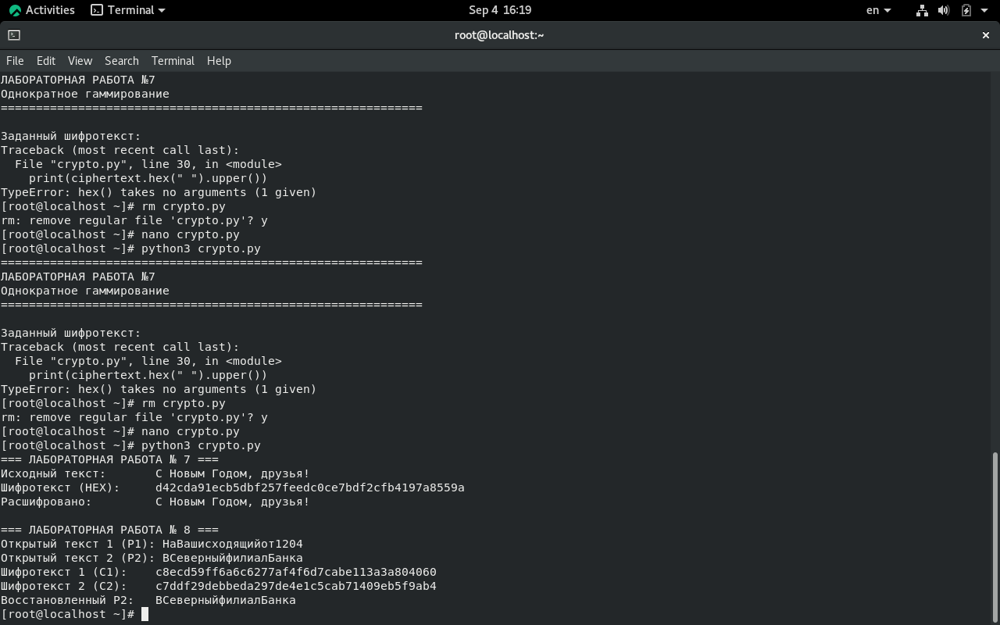

---
author:
  name: Назиров Алексей Анваржанович
  student_id: "1032240002"
  degrees:
  orcid:
  email: 1032240002@rudn.ru
  affiliation:
    - name: Российский университет дружбы народов
      country: Российская Федерация
      postal-code: 117198
      city: Москва
      address: ул. Миклухо-Маклая, д. 6

title: "Отчёт по лабораторной работе № 8"
subtitle: "Элементы криптографии. Шифрование (кодирование) различных исходных текстов одним ключом"
license: "CC BY"
---

# Цель работы

Освоить на практике применение режима однократного гаммирования на примере кодирования различных исходных текстов одним ключом.

# Задание

1. Разработать приложение для шифрования и дешифрования текстов $P_1$ и $P_2$ одним ключом.
2. Определить вид шифротекстов $C_1$ и $C_2$ при известном ключе для заданных телеграмм.
3. Реализовать аналитический способ прочтения обоих текстов злоумышленником без знания ключа с использованием свойства XOR ($C_1 \oplus C_2 = P_1 \oplus P_2$).

# Теоретическое введение

Повторное использование однократного ключа для шифрования двух разных открытых текстов приводит к уязвимости. Если сложить по модулю 2 два шифротекста, зашифрованных одним ключом, ключ взаимно уничтожается: $C_1 \oplus C_2 = (P_1 \oplus K) \oplus (P_2 \oplus K) = P_1 \oplus P_2$. Зная структуру одного из текстов (шаблон), злоумышленник может постепенно восстановить второй текст.

# Выполнение лабораторной работы

1. Задали исходные телеграммы Центра:
   $P_1 =$ `НаВашисходящийот1204`
   $P_2 =$ `ВСеверныйфилиалБанка`
   А также общий ключ $K =$ `05 0C 17 7F 0E 4E 37 D2 94 10 09 2E 22 57 FF C8 0B B2 70 54`.
2. С помощью разработанной программы получили шифротексты $C_1$ и $C_2$ для обеих телеграмм.
3. Выполнили операцию XOR над двумя шифротекстами ($C_1 \oplus C_2$), продемонстрировав получение результата сложения открытых текстов ($P_1 \oplus P_2$).
4. Смоделировали процесс восстановления текста $P_2$ с использованием известного шаблона $P_1$ по формуле $P_2 = C_1 \oplus C_2 \oplus P_1$. Зафиксировали результаты на снимках экрана.

# Выводы

В ходе работы мы на практике изучили критическую уязвимость повторного использования ключа в режиме гаммирования. Было показано, что повторное применение ключа компрометирует конфиденциальность сообщений, позволяя восстановить открытые тексты без знания самого ключа.

# Список литературы{.unnumbered}

::: {#refs}
:::
